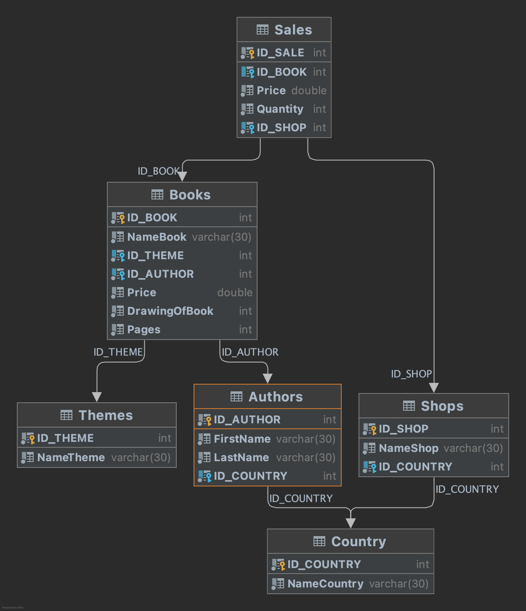

### Создайте базу данных Publishing.
**Добавте таблицу с такими полями:**
1. NameBook - название книги
2. NameTheme - тема книги
3. PriceOfBook - цена книги для продажи
4. DrawingOfBook - количество выпущенных книг
5. Pages - количество страниц книги
6. Price - цена продажи книги
7. Quantity - количество проданных книг
8. NameShop - название магазина, который продал книги
9. NameCountry - будет относиться как к магазину, который продавал книгу,
так и к автору, который ее написал (они могут быть разные)
10. FirstName - имя автора, написавшего книгу
11. LastName - фамилия автора, написавшего книгу

Нормализируйте данную таблицу.

