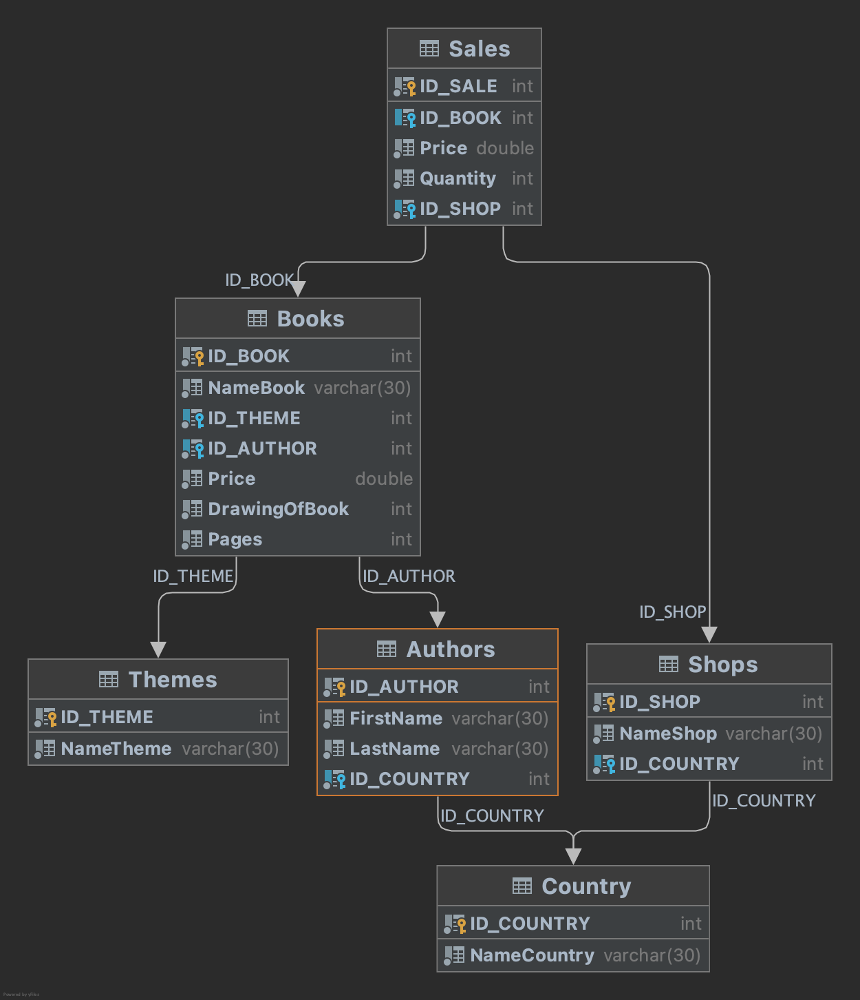

### Создайте базу данных Publishing.
**Добавте таблицу с такими полями:**

NameBook - название книги

NameTheme - тема книги

PriceOfBook - цена книги для продажи

DrawingOfBook - количество выпущенных книг

Pages - количество страниц книги

Price - цена продажи книги

Quantity - количество проданных книг

NameShop - название магазина, который продал книги

NameCountry - будет относиться как к магазину, который продавал книгу,
так и к автору, который ее написал (они могут быть разные)

FirstName - имя автора, написавшего книгу

LastName - фамилия автора, написавшего книгу

Нормализируйте данную таблицу.

